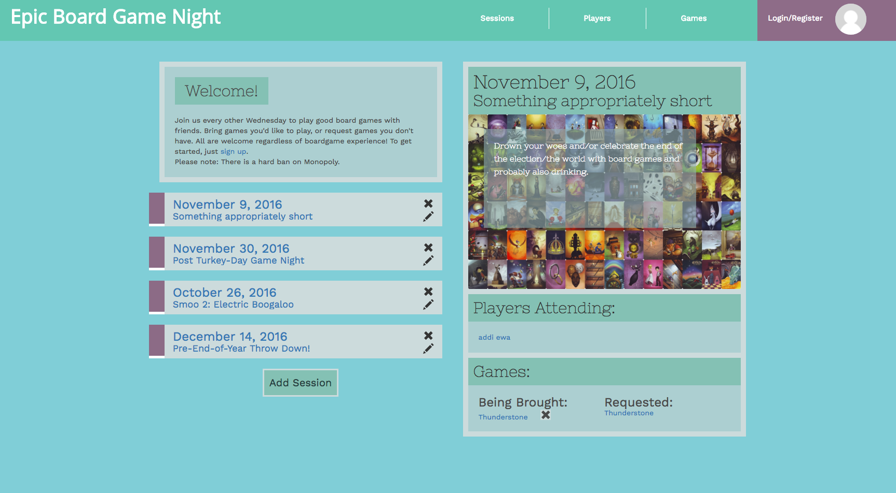

# Boardgame Meetup App

This is an app for the Super Awesome Board Game Session Night Thing. You can use it to RSVP for board game nights, request games, add games that you will be bringing AND MORE.

#### By **_Aimen Khakwani, Addison Nishijima, Ewa Manek, Zachary Matthewstearn_**
####  

## Features

* player sign up and login
* players can view a list of upcoming and previous sessions and who is attending or who attended
* players can view a list of the games being brought/requested for each session
* players can register for a session and unregister
* players can request games and add games they will bring
* players can see board game details via the boardgamegeek api
* players can access their profiles which will include:
  * games owned (with info from boardgamegeek)
  * events they are planning to attend
  * the ability to update their info
* players can access other players' profiles
* deploy to heroku

## Prerequisites

You will need the following things properly installed on your computer.

* [Git](http://git-scm.com/)
* [Node.js](http://nodejs.org/) (with NPM)
* [Bower](http://bower.io/)
* [Ember CLI](http://ember-cli.com/)
* [PhantomJS](http://phantomjs.org/)

## Installation

* `git clone <repository-url>` this repository
* `cd boardgame-meetup`
* `npm install`
* `bower install`
* if bootstrap is not working run 'ember install ember-bootstrap'

## Running / Development

* `ember serve`
* Visit your app at [http://localhost:4200](http://localhost:4200).

## Technologies Used

* JavaScript
* Ember JS
* Bootstrap
* Node.js and npm
* Bower
* SASS

### Deploying

Specify what it takes to deploy your app.

## License

Copyright (c) 2016 **_Aimen Khakwani, Addison Nishijima, Ewa Manek, Zachary Matthewstearn_**
